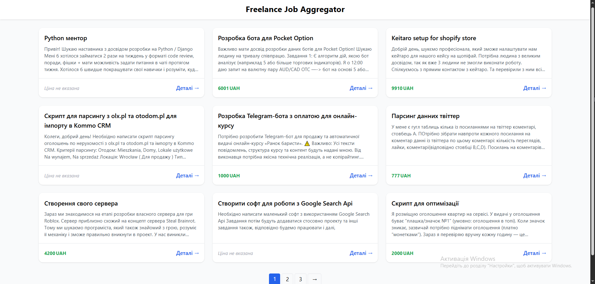

# 🚀 Freelance Job Aggregator

> **Швидко. Стильно. Легко.**  
> Більше не потрібно годинами відкривати десятки сайтів фрілансу — цей агрегатор збирає всі Python вакансії з Freelancehunt в одному місці! ⚡

---

## 🎯 Проект

Цей проект — **особистий інструмент для швидкого перегляду актуальних вакансій на Freelancehunt**.  
Він автоматично збирає інформацію про проекти та формує зручний JSON для подальшого використання у веб-інтерфейсі.

Особливості:
- ✅ Автоматичний збір вакансій з Freelancehunt
- ✅ Унікальні проекти без дублікатів
- ✅ Зберігання у `jobs.json` для фронтенду
- ✅ Легке масштабування на інші сайти
- ✅ Прямо “ready-to-use” для веб-інтерфейсу

---

## 🛠 Технології

- Python 3.11+ 🐍  
- [Selenium](https://selenium.dev/) — для рендеру динамічних сторінок  
- [BeautifulSoup](https://www.crummy.com/software/BeautifulSoup/bs4/doc/) — парсинг HTML  
- Django (optional) — для подальшого відображення вакансій  
- JSON — зручний формат для фронтенду  
- ChromeDriver — для керування браузером  

---

